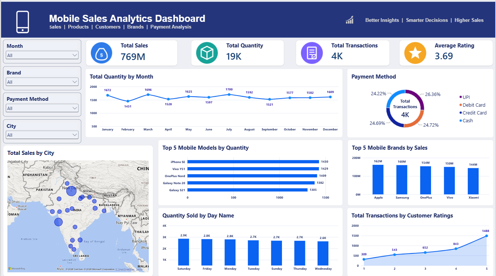

# Mobile Sales Analytics — Power BI Dashboard

An interactive Power BI dashboard analyzing 3,800+ mobile phone sales transactions across India — covering sales trends, brand performance, payment methods, geographic distribution, and customer ratings.

## 📊 Project Overview

This project transforms raw mobile sales transaction data into a decision-ready dashboard, answering key business questions:
- Which brands and models are selling the most?
- How do sales trend across months and days of the week?
- What payment methods do customers prefer?
- Which cities drive the most sales?
- How do customer ratings relate to transaction volume?

## 📁 Dataset

`Mobile_Sales_Data.xlsx` — 3,835 transaction records with the following fields:

| Column | Description |
|---|---|
| Transaction ID | Unique identifier for each sale |
| Day / Month / Year / Day Name | Date breakdown of the transaction |
| Brand / Mobile Model | Phone brand and specific model sold |
| Units Sold | Quantity sold in the transaction |
| Price Per Unit | Selling price per unit |
| Customer Name / Age / City | Customer details |
| Payment Method | UPI, Credit Card, Debit Card, or Cash |
| Customer Ratings | Rating (1–5) given by the customer |

## 📈 Dashboard Features

- **KPI cards** — Total Sales (₹769M), Total Quantity (19K units), Total Transactions (4K), Average Rating (3.69)
- **Total Quantity by Month** — line chart showing monthly sales trend
- **Payment Method breakdown** — donut chart comparing UPI, Debit Card, Credit Card, and Cash usage
- **Total Sales by City** — map visual showing geographic sales distribution across India
- **Top 5 Mobile Models by Quantity** — bar chart of best-selling models
- **Top 5 Mobile Brands by Sales** — bar chart of top-performing brands
- **Quantity Sold by Day Name** — bar chart showing weekday sales patterns
- **Total Transactions by Customer Ratings** — trend of transaction volume across rating levels
- **Slicers** — filter the entire dashboard by Month, Brand, Payment Method, and City

## 🛠️ Tech Stack

- Power BI Desktop
- Power Query (data transformation)
- DAX (measures for KPIs and aggregations)

## 🚀 How to Use

1. Download `Portfolio_Dashboard.pbix` and open it in [Power BI Desktop](https://www.microsoft.com/en-us/power-platform/products/power-bi/downloads) (free).
2. The dashboard uses `Mobile_Sales_Data.xlsx` as its data source — keep both files in the same folder, or update the data source path in Power BI (Home → Transform Data → Data Source Settings) if you move the Excel file.
3. Use the slicers on the left (Month, Brand, Payment Method, City) to filter and explore the data interactively.

## 📌 Key Insights

- Apple and Samsung lead brand-wise sales, followed closely by OnePlus, Vivo, and Xiaomi
- UPI is the most-used payment method, closely followed by Debit Card, Credit Card, and Cash — fairly evenly split
- Weekend (Saturday) sees the highest quantity sold, dipping toward mid-week
- Higher customer ratings correlate with a higher volume of transactions

## 📈 Possible Extensions

- Add year-over-year comparison once multi-year data is available
- Build a drill-through page for city-level or brand-level deep dives
- Add a customer segmentation view (age group vs. spending)

## 👤 Author

**Pavan Dev Sharma**
